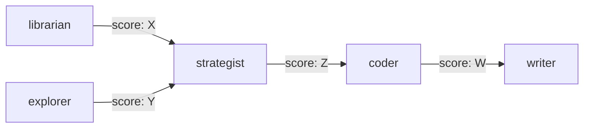

# Execution Trace — [Project] — [Date]

## Execution Graph

## Agent Invocation Table

| Agent | Critic | Rounds | Final Score | Duration | Status |
|-------|--------|--------|-------------|----------|--------|
| | | | | | |

## Escalation Events

[Any 3-strike escalations with context, or "None"]

## Artifacts Produced

| Artifact | Path | Score | Agent |
|----------|------|-------|-------|
| | | | |

## Pipeline Summary

- **Total agents dispatched:** N
- **Total rounds (including re-reviews):** N
- **Escalations:** N
- **Overall score:** X/100
- **Duration:** [start to end]
